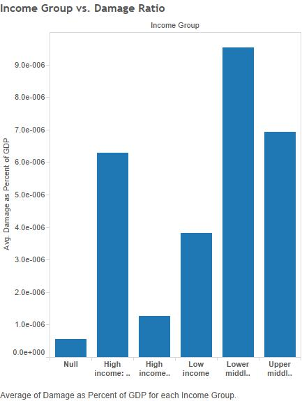

---

title: "CS 378 Data Science: An Analysis of Natural Disasters"

output: html_document

---

##What is a Natural Disaster?

It is a situation or event, which overwhelms local capacity, necessitating a request to national or international level for external assistance (definition considered in EM-DAT).

###Data Set and Sources

Our analysis relied on data from EM-DAT, the World Bank, the Advanced National Seismic System (ANSS), Global Risk Data Platform, and the World Data Service:

####[__EM-DAT__](http://www.emdat.be/database)

EM-DAT is an international disaster database founded by the Centre for Research on the Epidemiology of Disasters (CRED).  The EM-DAT database provided information from 1960-2014 such as:

* Disaster Type- Earthquakes, Storms, etc.

* Number Injured- Number of people reported injured in the disaster event.

* Number of Deaths- Number of people reported dead in the disaster event .

* Number left Homeless- Number of people reported homeless.

* Number Affected- Number - People requiring immediate assistance during a period of emergency, i.e. requiring basic survival needs such as food, water, shelter, sanitation and immediate medical assistance. Appearance of a significant number of cases of an infectious disease introduced in a region or a population that is usually free from that disease.

* Total Damage (Estimated) - Estimated loss caused by the disaster in US dollars.

####[__World Bank__](http://databank.worldbank.org/data/home.aspx)

The World Bank is a United Nations international financial institution that provides loans to developing countries for capital programs. We enriched our dataset by incorporating country indicators from 1960-2014:

* GDP (in US dollars)

* Population

* Income Group (Gross National Income per Capita)

* Many others…

####[__ANSS (Advanced National Seismic System) Global Earthquake Catalog__](http://ncedc.org/anss/catalog-search.html)

* ANSS is hosted by the Northern California Earthquake Data Center. The mission of ANSS is to provide accurate and timely data and information for seismic events, including their effects on buildings and structures.

* This dataset provided Global earthquake records from the last 50 years (since 2014) (~570,000 rows)

* Search parameters used:

    + catalog = ANSS

    + start_time = 1964/01/01,00:00:00

    + end_time = 2014/09/12,22:13:44

        + covers the last 50 years, anything larger would have been unmanageable/unrealistic at this point due to accuracy of data measurements

    + minimum_magnitude = 3.0

        + 3.0 was chosen as a minimum because that is generally the minimum threshold for people to notice an earthquake

    + maximum_magnitude = 10

    + event_type = E 

####[__Global Risk Data Platform: Earthquakes - Risk, Annual Average Losses__](http://preview.grid.unep.ch/index.php?preview=data&events=earthquakes&evcat=8&lang=eng)

* The Global Risk Data Platform is created and hosted by UNEP/GRID-Geneva and supported by UNISDR. The Global Risk Data Platform allows the visualisation of data on natural hazards, exposure (both human and economical), and risk.

* This dataset provided average annual losses from earthquakes (~ 200 rows after excluding those with missing data)

####[__National Geophysical Data Center / World Data Service (NGDC/WDS): Significant Volcanic Eruptions Database__](http://www.ngdc.noaa.gov/nndc/servlet/ShowDatasets?dataset=102557&search_look=50&display_look=50)

* World Data Service is hosted by the National Geophysical Data Center of the National Oceanic and Atmospheric Administration. 

* Search parameters were all left blank (so we used the entire data set, unfiltered)

* This dataset provides significant volcanic eruptions data (~650 rows)

    + includes eruptions over a long period of time (thousands of years) but predominantly contains information from the 1900s.

####[__National Geophysical Data Center / World Data Service (NGDC/WDS): Global Historical Tsunami Database__](http://www.ngdc.noaa.gov/nndc/struts/form?t=101650&s=70&d=7)

* Hosted by the National Geophysical Data Center of the National Oceanic and Atmospheric Administration.

* This dataset provides  Global tsunami source data (~2,500 rows) and Global tsunami runup data (~25,000 rows)

    + includes tsunamis from approximately the last two thousand years, but mostly from the last few hundred years.

* search parameters were all left blank (again using the entire data set, unfiltered)

* the url above links to the 'event' information, you can get to the 'runup' information [__here__](http://www.ngdc.noaa.gov/nndc/struts/form?t=101650&s=167&d=166)

##Geospatial Analysis

Our initial analysis used the following services ANSS, Global Risk Data Platform, and World Data Service to analyze specific natural disasters to get a sense of “what was interesting”:

* Earthquakes
* Tsunamis
* Volcanic Eruptions

Most of the work was exploratory. This analysis used RStudio to generate the results and process the data. Nothing of interest was really found but we learned a lot about R, RStudio, and Shiny. We also learned about the general workflow of obtaining the data, cleaning the data, filtering and applying transforms to see if the data revealed anything interesting. 

###Results
Below are some resulting graphs we were able to make using gvisGeoMap in the googleVis package in RStudio. (See Appendix for details on R code)
####Top 10 locations of economic loss due to tsunamis since 2010

####Top 10 locations of Volcano related deaths since 2010

####Top 8 locations of economic loss due to volcano eruptions since 2010

###Shiny App
The Shiny App interface:

The app allows you to see a map of top 10 seismic activity by magnitude since 1960. The slider bar allows you to adjust the year and the marks show information such as country name and magnitude.

##Natural Disasters: A Regional and Economic Perspective

Our more recent analysis considered the impact of natural disasters on countries internationally. This analysis used the EM-DAT and WorldBank data sets exclusively. 

This analysis used the unsupervised algorithms Clustering and Anomaly Detection from Oracle Data Miner:
### Rare Disasters
Anomalous records in our data have the following disaster type:  
*epidemics
*volcanic eruptions
*insect infestations
*mass movement (dry/wet)
*droughts

1) Bar graph that sums the total number of natural disasters by type and segments each individual category of disaster by predicate. Predicates are denoted by a '0' or '1', anomalies(orange) and normal (blue) occurrence, respectively. Natural disasters that happened rarely over the time period were more likely to be predicted as anomalous than records that occurred more commonly.

--picture of anomalous bar charts

2)The data set for the graph was generated by using the Anomaly Detection model in the Oracle Data Miner. The anomaly detection function ran on the support vector machine algorithm, and output from the applied model predicted anomalous records. 

--date miner

Then, after sorting the output on predicate(ascending) and probability(descending), we observed that the disaster types that occurred most in the normal predicate group consisted mostly of floods and storms compared to the anomalous groups that had types of epidemics, insect infestations, volcanic eruptions, droughts, mass movements(dry/wet).

Afterward, to further the analysis, we attempted to discover any more correlations or patterns that could possibly explain any of the groupings for anomalous and normal records.

###Disaster Trends

These series of bar charts plot the Occurrence vs Year for each disaster type we analyzed. Each bar is broken into color coded income groups to see the distribution of occurrences.

The Occurrence measures how many times the disaster of that type occurred in a certain country for that year.

Out of all the disaster types high income countries seem to deal with frequent storms.

Disaster occurrences seem to be on the rise except for epidemics, insect infestation, mass movement (dry/wet), volcanoes, and wildfires.

### Measuring Disaster Significance

We chose to measure a natural disasters impact relative to a country in terms of two measures to more accurately assess the damage done by the disaster to the country.

* Demographic Damage Ratio=(#Affected + #Injured +#Deaths + #Homeless)/Population of Country

* Damage GDP Ratio= Total Damage /GDP of country

This is a bar chart plotting the average Damage GDP Ratio per year for all countries. 
Each bar is broken into different colors by income group. We can see a disproportionate distribution of 
income groups contributing to the overall average.

Historically, High income countries (Orange and Green) do not contribute to the average Damage GDP Ratio as much as Low to Middle income countries.

2)This bar chart depicts similar information to the previous one except the average Demographic Damage Ratio is calculated for each year.

Historically, High income countries do not sustain as much demographic damage than low to middle income countries.

3)This scatterplot shows which disasters contributed most to the average Demographic Damage Ratio and the average Damage GDP Ratio (the averages were calculated across all years). It sums up the previous two bar charts by removing the Year axis and considering how much each country, color coded by its income group, contributed to each of the Average Damage GDP ratio and the Demographic Damage Ratio.

The outliers in the 1st,2nd, and 4th quadrants are lower to upper middle income countries. This plot reveals the outliers contributing disproportionately to the overall Averages of Demographic Damage and Damage GDP Ratios.

High income countries suffer less economic and demographic damage among natural disasters according to our data. Surprisingly, Low Income countries mostly lie in the third quadrant.

--data miner

These visuals were inspired by the cluster analysis done in Oracle Data Miner. We ran various attributes we wanted to cluster and the ones that seemed most interesting were our two measures with income group. We further

We used the K-Means algorithm and saw that the decision tree it produced generally grouped lower income countries into clusters with high demographic damage ratios and high damage gdp ratios. This led us to consider the scatterplot above. Then, we wondered if time played a role to see if these clusterings generally held. This led to two the bar charts above.

What we found: Low to middle Income countries contribute disproportionately more to the average of the demographic damage ratio and the damage gdp ratio.

### Per Capita Analysis

We wanted to use data mining with some calculated per capita measures in order to gain some more insight into the data and the economic characteristics of countries which are exposed to certain disasters. First, using a SQL query, shown here, we calculated GDP per capita, number of affected people per capita, number of deaths per capita, and the ratio of economic damage to GDP.

Though we tried several different algorithms with this data, most didn’t show much promise in regards to finding anything interesting. However, we did finally come across something using some of the clustering algorithms, which fit well with the analysis we had done in Tableau, discussed in the previous section. The Oracle Data Miner nodes shown here (along with some extra details) show the basic approach used, where we did one set of algorithms using the continuous ‘GDP per Capita’ measure and the other with the discrete ‘Income Group’ measure instead.

Shown in the next two sets of images, some of the clustering algorithms indicated some pretty interesting trends. In one run, 98% (!) of disasters were grouped into a single node. Though no other variation that we tried got result quite so staggering, most of them suggested a similar trend of lower income countries being disproportionately affected by more significant, and sometimes chronic, disasters.

A second interesting clustering:

Taken together, the clustering builds we ran suggested a fairly clear overall trend:
*   The vast majority of disasters (up to 98%) affect only a small portion of the populations of countries that they hit (< 11.5%).
*   The remaining disasters are the ones which affect a much more substantial portion of the populations (sometimes even more than 50%).
*   These disasters are limited almost exclusively to countries with a relatively low GDP per capita, or low income classification.

Going off of this information, and keeping in mind what we had done earlier in Tableau (as mentioned in the previous section) we constructed a few more graphs that seemed to really reinforce what our previous analysis had suggested.

These first scatterplots show GDP per Capita plotted against the ‘Affected Ratio’ (number of affected people per capita) and the ‘Damage Ratio’ (ratio of economic damage to GDP), respectively. 

These two plots do well to highlight the general trend of lower income countries being the ones most severely affected by disasters, at least proportionally to their overall population and GDP. Though some of the disasters with the highest ‘Affected Ratio’ took place in countries with smaller populations, thus perhaps accounting for a bit of the trend, it is still fairly evident that wealthier countries with relatively low populations are not as strongly affected in the same way. 

For the next two graphs, we used the discrete ‘Income Group’ measure as opposed to ‘GDP per Capita’. Key to fully understanding these graphs is the distinction between the two groups of high income nations. One group consists of members of the OECD (Organization for Economic Co-operation and Development) while the other consists of the rest of the high income countries which are not members. The following map shows which high income countries fall into which category.

As can be seen, high income OECD countries consist of most of western Europe, the United States, Canada, Israel, Australia, New Zealand, and Chile. The other high income nations are Kuwait, Saudi Arabia, Russia, Latvia, Lithuania, Uruguay, and a few others. Basically, high income OECD countries consist largely of those nations we would colloquially consider as “the West”, which is why the distinction is an interesting and useful one to make.

These next two bar graphs show the average ‘Affected Ratio’ and the average ‘Damage Ratio’ of disasters, respectively, per income group. 

The first of these graphs shows clearly that low income countries have a significantly higher percentage of their population affected by disasters, on average. Upper middle income countries fare slightly better, but the difference to the high income countries (OECD or not) is stark, as those have much smaller proportions of their population affected by any given disaster. The damage ratio graph shows a similar, but slightly different story, and is where we see the real differences between the high income OECD and non-OECD countries. The high income countries not part of the OECD (and “the West”) see a damage ratio almost equal to that of upper middle income countries, while the high income OECD nations have a significantly lower average damage ratio. Interestingly, low income countries have a relatively lower average damage ratio, which could be a result of less expensive infrastructure that can be destroyed. However, what is clear from these two graphs is that high income western nations suffer disproportionately less overall from natural disasters, even compared to their high income counterparts in the rest of the world. The dichotomy of who suffers from these disasters is stark, and Western nations have insulated themselves from the worst of the damages while the rest of the world continues to relatively struggle to cope with disasters.

##Tableau Demo

The Regional Analysis Dashboard summarizes our findings into one app that allows users to explore different combinations of disaster types, income groups of countries, and even filter the results by region. The pie chart on the left bottom displays the distribution of disaster occurrences for High Income countries. The colors represent the disaster type and the size of each slice corresponds to the number of occurrences from 1960-2014. 

The user can see the results of their choices on a map whose marks are color and size coded according to the average of the two damage ratios we considered Damage GDP ratio and Demographic Damage Ratio. 

The image of the interface shows that Storms account for the largest number of occurrences in our database for High Income countries. The map reveals the Americas (more specifically the Caribbean) to be prone to economic and human loss.

##Conclusions and Future explorations

Our overall analysis shows that Countries with lower to middle incomes (GNI) suffer disproportionately more from natural disasters. From our clustering analysis we were able to conclude

* Low to middle income countries suffer disproportionately compared to high income countries in terms of economic damage and casualties (demographic damage) on average.

One result that surprised us was the detection of epidemics and even insect infestations as anomalous. We suspect this is because there are still low to lower middle income countries suffering from poor sanitation leading to disease and infestation. Some ideas for the future to extend our analysis in this direction could be to:

* identify the particular disasters such as epidemics that low income countries face,research which treatments or vaccines have been available, and compare the cost of these treatments with the cost these epidemics have already taken.

* Identify why droughts do so much demographic damage across all countries.

* Find correlations between damage done by disaster types across different income groups (e.g. does extreme temperature play a role in droughts? How much stronger or weaker is this correlation if we restrict our analysis to low to middle income countries? )

* Extend the Tableau Dashboard to filter by Year

Copyright © 2014 Mark Sandan & Kevin Roesner & Arturo Lemus 
